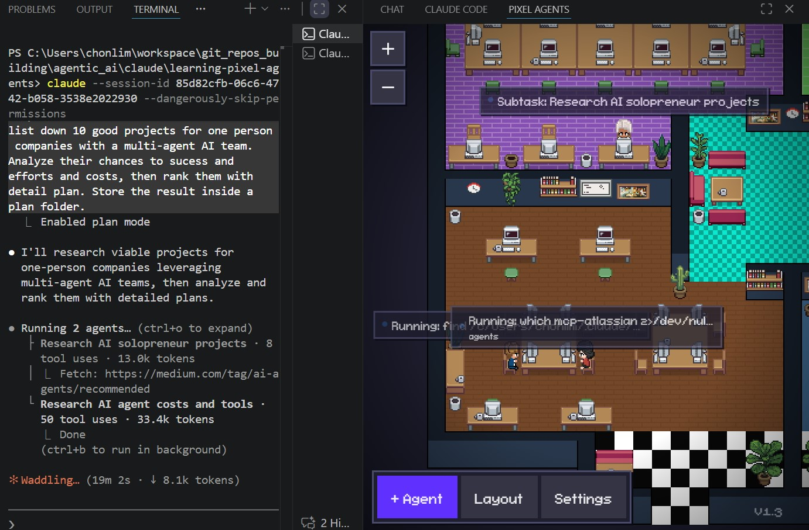

# Pixel Agents Research

**Author: Chong Kiat Lim**

This repository is for researching and studying the [Pixel Agents](https://github.com/pablodelucca/pixel-agents) VS Code extension — a pixel art office where AI agents come to life as animated characters.

> **Original Repository:** [https://github.com/pablodelucca/pixel-agents](https://github.com/pablodelucca/pixel-agents)
>
> A full copy of the original source code is included in the [`pixel-agents/`](pixel-agents/) directory for research and study purposes. All credit for the extension goes to the original author(s).

📄 [DOCS.md](docs/DOCS.md) — Complete technical documentation | ❓ [FAQ.md](docs/FAQ.md) — Frequently asked questions


*Multi-agent office in action — two agents researching in parallel with speech bubbles showing live status*

## What Is Pixel Agents?

Pixel Agents is an open-source VS Code extension that gives you a visual, game-like dashboard for managing multiple Claude Code AI agents. Each agent running in a terminal becomes an animated pixel art character in a customizable virtual office. Characters walk around, sit at desks, type when writing code, read when searching files, and display speech bubbles when they need your attention.

**Think of it as "The Sims" for your AI coding agents** — but the results are real code being written.

## Quick Start

```bash
# Clone and build
git clone https://github.com/pablodelucca/pixel-agents.git
cd pixel-agents
npm install
cd webview-ui && npm install && cd ..
npm run build

# Launch in VS Code
# Press F5 to start the Extension Development Host
```

### Or install from VS Code Marketplace

Search for "Pixel Agents" in VS Code Extensions (`Ctrl+Shift+X`).

## How It Works
```
You click "+ Agent"
    → VS Code terminal opens running: claude --session-id <uuid>
    → A pixel character spawns in the office (Matrix-style rain effect)
    → Extension watches ~/.claude/projects/<hash>/<session-id>.jsonl
    → When Claude uses tools (Write, Read, Bash, etc.)...
        → Character walks to its desk and starts typing/reading animation
        → Status label shows what it's doing ("Writing main.ts")
    → When Claude finishes...
        → Character shows green ✓ bubble, plays a chime
        → Character gets up and wanders around the office
    → If Claude needs permission...
        → Character shows amber "..." bubble, plays attention sound
        → Click the bubble to focus that agent's terminal
```

## Architecture at a Glance

| Layer | Location | Technology | Purpose |
|---|---|---|---|
| **Webview UI** | `webview-ui/src/` | React 19 + Canvas 2D + Vite | Game rendering, character animation, layout editor |
| **Extension Backend** | `src/` | Node.js + VS Code API + esbuild | Agent lifecycle, JSONL parsing, file watching |
| **Server** | `server/src/` | Node.js HTTP (no framework) | Receives instant hook events from Claude Code |
| **Shared** | `shared/assets/` | TypeScript | PNG decoding, manifest parsing, shared constants |

## Key Files to Study

### Extension Backend (`src/`)

| File | What It Does |
|---|---|
| `extension.ts` | Entry point — registers view provider and commands |
| `PixelAgentsViewProvider.ts` | **Central orchestrator** — manages everything: webview, agents, assets, server |
| `agentManager.ts` | Creates/removes/restores Claude Code terminals and agent state |
| `transcriptParser.ts` | **Core intelligence** — parses JSONL lines to detect tool usage, turn completion, permissions |
| `fileWatcher.ts` | Polls JSONL files (500ms), detects new sessions, handles `/clear` |
| `timerManager.ts` | 5s waiting timer + 7s permission timer for heuristic status detection |
| `assetLoader.ts` | Loads character sprites, floor tiles, wall tiles, furniture from PNGs/manifests |
| `layoutPersistence.ts` | Layout file I/O at `~/.pixel-agents/layout.json` with cross-window sync |

### Webview UI (`webview-ui/src/`)

| File | What It Does |
|---|---|
| `App.tsx` | Composition root — creates game state, hooks up message handlers |
| `office/engine/officeState.ts` | **Imperative game world** — characters, seats, furniture (lives outside React) |
| `office/engine/characters.ts` | Character FSM: IDLE ↔ WALK ↔ TYPE with wander AI |
| `office/engine/renderer.ts` | Canvas 2D pipeline: z-sorted pixel-perfect rendering |
| `office/engine/gameLoop.ts` | `requestAnimationFrame` loop with delta time |
| `office/engine/matrixEffect.ts` | Matrix-style spawn/despawn digital rain animation |
| `office/sprites/spriteData.ts` | Character/furniture sprite data and hue shifting |
| `office/sprites/spriteCache.ts` | WeakMap-based sprite → canvas cache per zoom level |
| `office/layout/tileMap.ts` | Walkability grid + BFS pathfinding |
| `office/layout/furnitureCatalog.ts` | Dynamic catalog from loaded assets |
| `hooks/useExtensionMessages.ts` | Handles all messages from extension → updates game state |

### Server (`server/src/`)

| File | What It Does |
|---|---|
| `server.ts` | HTTP server on `127.0.0.1`, receives hook events, auth via Bearer token |
| `hookEventHandler.ts` | Routes 11 hook event types to the correct agent |
| `providers/file/claudeHookInstaller.ts` | Installs/uninstalls hook script in `~/.claude/settings.json` |

## Agent Status Detection

Two modes work in tandem:

### Hooks Mode (Preferred — instant)
Claude Code's Hooks API sends HTTP events directly to the local server. 11 event types cover session lifecycle, tool usage, permissions, and sub-agents.

### Heuristic Mode (Fallback — polling-based)
Falls back to JSONL file polling with timing heuristics:
- **500ms** — JSONL file polling interval per agent
- **5 seconds** — text-idle timeout → assume turn is done
- **7 seconds** — no new data after tool start → assume needs permission
- **300ms** — delay before reporting tool completion (prevents flicker)

## Character System

### States: IDLE → WALK → TYPE

- **IDLE**: Standing pose. Periodically wanders to random tiles (3-6 times), then rests at seat (2-4 minutes)
- **WALK**: 4-frame walk cycle. BFS pathfinding on 4-directional grid. Used for both task-directed movement and wandering
- **TYPE**: 2-frame animation at desk. Typing (Write/Edit/Bash/Task tools) or Reading (Read/Grep/Glob/WebFetch tools)

### Sprites
- 6 diverse character palettes (char_0.png–char_5.png)
- 7 frames per direction × 3 directions (down, up, right; left = flipped right)
- Hue-shifted duplicates for 7+ simultaneous agents

## Limitations

| Area | Limitation |
|---|---|
| **Agent support** | Claude Code only (no Copilot, Codex, Cursor, etc.) |
| **Platform** | VS Code only (no standalone app, web, or other IDEs) |
| **Observational only** | Can't assign tasks, redirect agents, or manage work queues |
| **Terminal sync** | Agent-terminal binding can desync on rapid open/close or session restore |
| **Heuristic detection** | Without hooks, status detection relies on timing assumptions that can misfire |
| **6 unique skins** | Beyond 6 agents, characters reuse palettes with hue shifts |
| **No conversation view** | Can't view agent conversation history — must switch to terminal |
| **Single layout** | One office layout shared across all workspaces |
| **No custom characters** | Only furniture is customizable via external asset packs |

## Configuration

| Setting | Location | Description |
|---|---|---|
| Sound enabled | VS Code globalState | Audio notifications on/off |
| Hooks enabled | VS Code globalState | Use Hooks API for instant detection |
| Watch All Sessions | VS Code globalState | Monitor external Claude Code sessions |
| Office layout | `~/.pixel-agents/layout.json` | Shared across all windows |
| External assets | `~/.pixel-agents/config.json` | Custom furniture pack directories |
| Agent state | VS Code workspaceState | Per-workspace agent persistence |

## Detailed Documentation

See [DOCS.md](docs/DOCS.md) for the complete technical documentation covering:
- Full architecture deep-dive
- End-to-end data flow diagrams
- All JSONL record types and parsing logic
- Rendering pipeline details
- Layout editor guide
- Server security model
- Asset system and custom furniture
- Complete troubleshooting guide

## Tech Stack & Demonstrated Skills

| Skill | Description |
|---|---|
| **VS Code Extension Development** | Understanding extension activation, webview providers, command registration, and the VS Code API lifecycle |
| **TypeScript** | Strongly-typed codebase across extension backend, server, shared modules, and React frontend |
| **React 19** | Modern React with hooks, functional components, and imperative game state management outside the React tree |
| **Canvas 2D Rendering** | Pixel-perfect sprite rendering, z-sorting, camera systems, zoom/pan, and requestAnimationFrame game loops |
| **Game Engine Patterns** | Finite state machines (character FSM), BFS pathfinding, sprite sheets, tile maps, and animation systems |
| **Node.js HTTP Server** | Custom HTTP server with Bearer token auth, timing-safe comparison, body size limits, and localhost binding |
| **File System Watching** | Hybrid `fs.watch` + polling for cross-platform JSONL file monitoring and cross-window layout sync |
| **JSONL Stream Parsing** | Incremental parsing of Claude Code transcript files with offset tracking and line buffering |
| **IPC & Messaging** | Extension ↔ Webview communication via `postMessage`, and Claude Code → Extension via hook events |
| **esbuild & Vite** | Dual build pipeline — esbuild for the extension backend, Vite for the React webview UI |
| **Pixel Art & Sprite Systems** | Sprite sheet slicing, hue-shift recoloring, rotation groups, and animation frame management |
| **Layout Editor (Drag & Drop)** | Full tile-based editor with paint/erase/place tools, undo/redo stack, grid expansion, and JSON export/import |
| **Security Practices** | Localhost-only binding, crypto-random auth tokens, `timingSafeEqual`, body size enforcement, atomic file writes |
| **Multi-Window Coordination** | Singleton server pattern, file-based discovery (`server.json`), and layout sync across VS Code windows |
| **Audio Synthesis** | Web Audio API sound generation without audio files — synthesized chimes for notifications |
